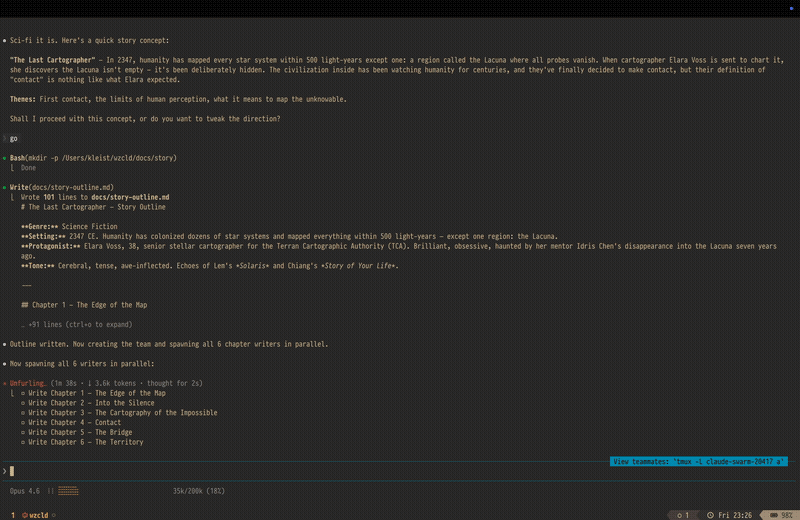

```
 ██╗    ██╗ ███████╗ ███████╗  ██████╗ ██╗     ██████╗
 ██║    ██║ ██╔════╝ ╚══███╔╝ ██╔════╝ ██║     ██╔══██╗
 ██║ █╗ ██║ █████╗     ███╔╝  ██║      ██║     ██║  ██║
 ██║███╗██║ ██╔══╝    ███╔╝   ██║      ██║     ██║  ██║
 ╚███╔███╔╝ ███████╗ ███████╗ ╚██████╗ ███████╗██████╔╝
  ╚══╝╚══╝ ╚══════╝ ╚══════╝  ╚═════╝ ╚══════╝╚═════╝
```

[](https://github.com/afewyards/wezcld/releases/latest)

**WezTerm it2 shim for Claude Code agent teams**



## Why

Claude Code uses iTerm2 split panes to manage agent teams. wezcld intercepts `it2` CLI commands and translates them to WezTerm CLI calls, letting you use native WezTerm splits instead of iTerm2.

## Install

```sh
curl -fsSL https://raw.githubusercontent.com/afewyards/wezcld/main/install.sh | sh
```

## Usage

Launch Claude Code with WezTerm integration:

```sh
wezcld
```

When running outside WezTerm, `wezcld` automatically falls back to plain `claude`.

## How it works

**Architecture:**

- **`wezcld` launcher**: Sets `TERM_PROGRAM=iTerm.app` and puts the shim's `bin/` directory first in `PATH`, then launches Claude with `--teammate-mode tmux`
- **`bin/it2` shim**: Intercepts `it2` CLI commands and translates them to real `wezterm cli` calls
- **Grid layout**: Agent panes are arranged in a 3-column grid, with the leader pane kept at the bottom

## Supported commands

| Command | WezTerm action |
|---------|----------------|
| `--version` / `app version` | Returns `it2 0.2.3` |
| `session split [-v]` | `wezterm cli split-pane` (grid layout) |
| `session run -s <id> <cmd>` | `wezterm cli send-text --pane-id <id>` |
| `session close -s <id>` | `wezterm cli kill-pane --pane-id <id>` |
| `session list` | Minimal session table |
| All other commands | Silent success (exit 0) |

## Requirements

- **wezterm CLI** (included with WezTerm)
- **POSIX-compatible shell** (bash, zsh, dash, ash)
- **Claude Code** (the CLI tool from Anthropic)

## Uninstall

```sh
curl -fsSL https://raw.githubusercontent.com/afewyards/wezcld/main/install.sh | sh -s -- --uninstall
```

## Development

**Running tests:**

```sh
./tests/integration-test.sh
```

**Rebuilding installer:**

```sh
./scripts/build-installer.sh
```
